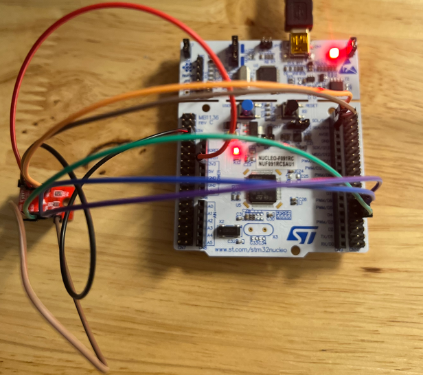
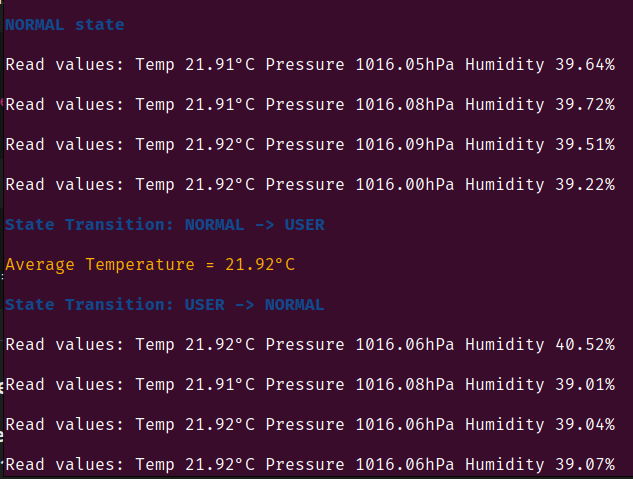
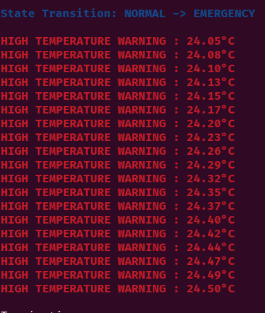
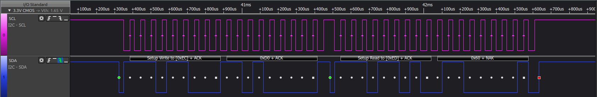
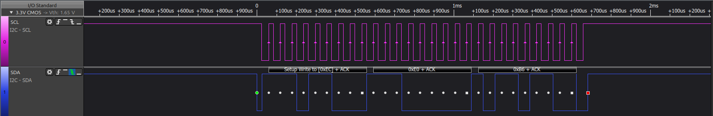

[](https://classroom.github.com/a/M-vWKnx0)
[](https://classroom.github.com/online_ide?assignment_repo_id=21811110&assignment_repo_type=AssignmentRepo)
# Final Project (Fall 2025)
# BME280 Weather Station
## Overview
This project implements an environment monitoring system based on an STM32F091RC 
microcontroller. A BME280 sensor is interfaced through I2C to acquire temperature, 
pressure, and humidity data. The system features a finite-state machine (FSM) - 
using the switch/case approach, that transitions between NORMAL,
EMERGENCY, and USER states based on temperature thresholds and user input.

A circular buffer stores recent temperature samples to maintain a running average. 
LED behavior, including blink rate and brightness is controlled via TIM7 and PWM 
(TIM2) to visually indicate system state. Peripheral drivers were implemented in 
bare-metal C for I2C, SPI, timers, PWM, and GPIO.
**NOTE:** The sensor’s I2C communication did not function correctly at first. 
Due to time constraints, the project was completed using the SPI interface as a 
fallback. I later resolved the I2C read/write issues, but the SPI interface 
produced more reliable measurements, so the project includes code for both interfaces
under `#ifdef` blocks. However, since the initial proposal involved using I2C, 
all test results presented correspond to configurations with I2C interfacing enabled.

## Code structure
This project is structured into several software modules that work together to 
read environmental data from the BME280 sensor, process it, and update the LED 
indicator (LD2) and terminal output based on system state.
`main()` - Serves as the entry point of the firmware is responsible for the 
initialization and execution of all peripherals and system modules. The structure 
is modular, with each function responsible for a specific hardware or software component.

**Communication Interface Initialization**
`I2C_Init()`: Sets up the I2C1 peripheral, configures GPIO pins, timing, and the BME280 interface.

**PWM Initialization**
`PWM_Init()`: Initializes PWM output on PA5 using TIM2 Channel 1 with a 50% duty cycle
and and PWM frequency of 1 kHz.

**BME280 Sensor Initialization**
`BME280_Init()`: The BME280_Init() function initializes the BME280 sensor and 
prepares it for measurement. It first verifies the sensor by reading the chip ID 
(0x60) and performs a soft reset to ensure proper startup. Calibration data for 
temperature, pressure, and humidity is then read from the sensor’s registers and 
stored for compensating future measurements.

After calibration, the sensor is configured for normal operation with x1 
oversampling for temperature, pressure, and humidity, standby time set to 0.5 ms, 
and the internal filter disabled. The function returns a success code once the 
sensor is ready, ensuring accurate and reliable readings.

**Data acquisition setup**
`Init_DataAcquisition()`: Initializes the data acquisition module. Sets up 
buffers, I2C read routines, or data logging structures.

**FSM initialization**
`Init_FSM()`: Sets up the FSM controlling system states (e.g., NORMAL, EMERGENCY, USER).
Prepares state variables, timers, and transition rules.

**System Tick Timer**
`init_systick()`: Configures the SysTick timer for periodic interrupts. Used for 
timing delays, periodic sensor reads, or updating system states.

**TIM7 Initilization**
`Init_TIM7()`: Configures TIM7 for LED blinking.

**Logging**
`log.h`: Logs the initial state of the system to the UART terminal. Provides 
feedback for debugging and monitoring state transitions.

**FSM execution**
`run_FSM()`: Starts the main FSM loop. Handles transitions between NORMAL, USER 
and EMERGENCY states based on sensor readings and inputs.

## Data Acquisition Module (`data_acquisition.c`)
The system continuously collects sensor readings each system tick. It uses 
`I2C_ReadReg`/`I2C_WriteReg` for register-level communication. A circular buffer
is used to store the last 60 samples. It also maintains a running average without iterating 
over the buffer.
**Core function**
```
void acquire_data(BME280_Data* data)
{
   BME280_ReadAll(data);

   if (write_to_buffer(&data_buffer, data) == -1)
   {
      INFO_LOG("Write to buffer failed!!");
   }

   running_sum_temp += data->temperature;

   if(cbfifo_length(&data_buffer) == 60)
   {
      BME280_Data old_sample;
      read_from_buffer(&data_buffer, &old_sample);
      running_sum_temp -= old_sample.temperature;
   }
   avg_temp = running_sum_temp/cbfifo_length(&data_buffer); 
}
```

## Finite State Machine (FSM)
The FSM has three states:
**State:NORMAL**
- Logs current sensor readings.
- Checks for switch activation -> transitions to `USER`.
- Checks for high temperature -> transitions to `EMERGENCY`.

**State:EMERGENCY**
- Logs high-temperature warning.
- Switch activation transitions to -> `USER`.
- Temperature drops below threshold transitions to -> `NORMAL`.

**State:USER**
- Logs moving average temperature from the circular buffer.
- Temperature exceeds threshold transitions to -> `EMERGENCY`.
- Else returns to `NORMAL`.

**FSM operation**
`run_FSM()` ensures the FSM executes once per tick:
```
void run_FSM()
{
   ticktime_t tick_counter = 0;
   while (1)
   {
      if (tick_counter != get_current_tick())
      {
         FSM();
         tick_counter = get_current_tick();
      }
   }
}
```

## LED Control System
**Brightness**
```
/**
 * @brief Defines predefined brightness levels for the ULED(LD2).
 *
 * This enum provides symbolic names for ULED brightness levels
 * corresponding to different system states:
 *  - `NORMAL_BRIGHTNESS` : Brightness level used in NORMAL state.
 *  - `EMERGENCY_BRIGHTNESS` : Maximum brightness used in EMERGENCY state.
 *  - `USER_BRIGHTNESS` : User-defined brightness used in USER state.
 */
typedef enum
{
   NORMAL_BRIGHTNESS = 0x87,
   EMERGENCY_BRIGHTNESS  = 0xFF,
   USER_BRIGHTNESS  = 0x0F
} LEDBrightness;
```
Based on FSM state, the LED toggles between brightness or OFF:
```
void blink_LED()
{
   if (info.state == USER)
   {
      info.led_brightness = USER_BRIGHTNESS;
   }
   else
   {
      if (info.led_brightness == 0)
      {
         if (info.state == NORMAL)
         {
            info.led_brightness = NORMAL_BRIGHTNESS;
         }
         else
         {
            info.led_brightness = EMERGENCY_BRIGHTNESS;
         }
      }
      else
      {
         info.led_brightness = 0;
      }
   }
   led_brightness(info.led_brightness);
}
```
The frequency at which the LED blinks depends on the ARR register value for the state
the systems is in:
```
/**
 * @brief Defines the LED blink periods corresponding to FSM states.
 *
 * This enumeration provides symbolic names for the LED update intervals:
 *  - `NORMAL_PERIOD`    : Blink period for NORMAL state (1 second).
 *  - `EMERGENCY_PERIOD` : Blink period for EMERGENCY state (0.25 seconds).
 *
 * The values represent timer auto-reload (ARR) register counts.
 */
typedef enum
{
   NORMAL_PERIOD = 999, //1 sec
   EMERGENCY_PERIOD = 249 //0.25 sec
}LEDPeriod;

/**
 * @brief Returns the LED blink frequency based on the current FSM state.
 *
 * This function determines the appropriate blink period for the ULED
 * depending on whether the system is in NORMALor EMERGENCY or USER state.
 *
 * @return uint16_t Blink period value (ARR register value) corresponding
 *                  to the current state.
 *
 * @note Uses the global `info.state` to determine the current FSM state.
 */
uint16_t blink_frequency()
{
   uint16_t arr_val = NORMAL_PERIOD;
   if (info.state == NORMAL)
   {
      arr_val = NORMAL_PERIOD;
   }
   else
   {
      arr_val = EMERGENCY_PERIOD;
   }
   return arr_val;
}
```

## Timer module (`timer.c`)
Used to generate interrupts to cause LED blinking effect:
```
void TIM7_IRQHandler(void)
{
   // Check if update interrupt flag is set
   if (TIM7->SR & TIM_SR_UIF)
   {
      TIM7->ARR = blink_frequency();
      blink_LED();
      TIM7->SR &= ~TIM_SR_UIF; // Clear interrupt flag
   }
}
```

## I2C Driver (`i2c.c`)
Initializes the I2C1 peripheral for communication with the BME280 sensor. 
This `I2C_Init` function configures the I2C1 peripheral and associated GPIO pins
on STM32F0 for standard mode (100 kHz) operation. It performs the following steps:
- Enables clock gating for I2C1 and GPIO port B.
- Configures PB8 (SCL) and PB9 (SDA) as alternate function open-drain pins with pull-ups.
- Resets I2C1 peripheral.
- Sets timing register for 100 kHz standard mode with 48 MHz system clock.
- Configures CSB (PB12) and SDO (PB14) pins to select I2C interface and address 0x76.
- Enables I2C1 peripheral.

`I2C_WriteReg()`: Writes data to a register of an I2C slave device. This function 
performs a blocking write operation over I2C1 to a specified device and register. 
It sends the START condition, device address, register address, data bytes, and 
finally issues a STOP condition.

`I2C_ReadReg`: Reads data from a register of an I2C slave device. This function 
performs a blocking read operation over I2C1 from a specified device and register. 
It performs the following steps:
- Sends a START condition and writes the device address with write mode.
- Sends the target register address.
- Sends a repeated START condition with the device address in read mode.
- Reads the specified number of bytes into the provided buffer.
- Issues a STOP condition to end the transaction.

## Observed output
**Hardware setup**


**Sensor output**



**I2C Read**


**I2C Write**


## Conclusion
This system demonstrates a fully functional embedded monitoring and alert module 
using bare-metal STM32 programming. The system reliably measured temperature and 
responded correctly to abnormal conditions, as verified through testing and 
controlled heat experiments.


References:
1. https://github.com/alexander-g-dean/ESF/tree/master/ST/Code/
2. Embedded Systems Fundamentals with Arm Cortex-M based Microcontrollers - Alexander Dean
3. RM0091 Reference manual
4. RM0091 Reference manual - Appendix code examples
5. BME280 Datasheet
